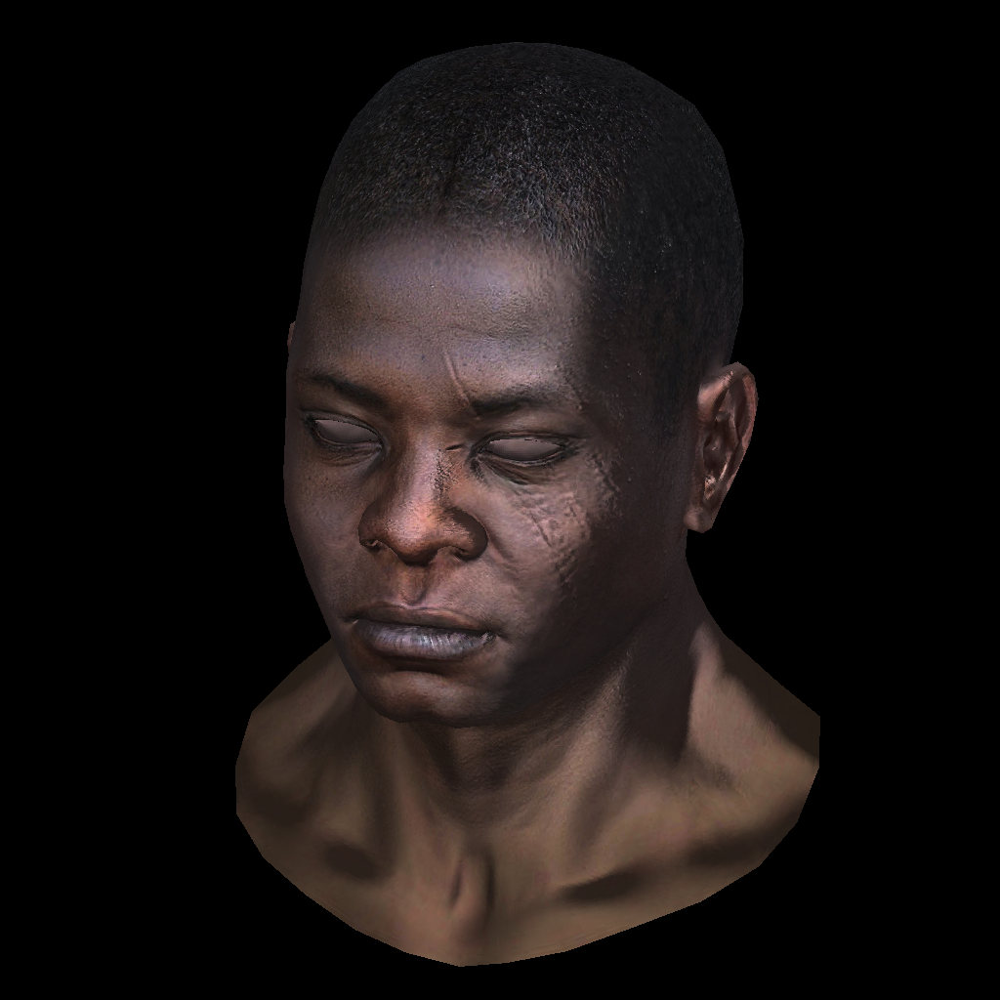

# Moteur 3D

Ce projet en C++ s'inscrit dans le cadre de cours "Fonctionnement d'un moteur de rendu 3D" enseigné en Master 1 à l'Université de Lorraine par Dmitry V. Sokolov.
Ce programme est basé sur [Github repository](https://github.com/ssloy/tinyrenderer) de Dmitry V. Sokolov.

# Clone

```bash
git clone https://github.com/clairekth/moteur3D.git
cd moteur3D
make && ./main
```

# Rendu


